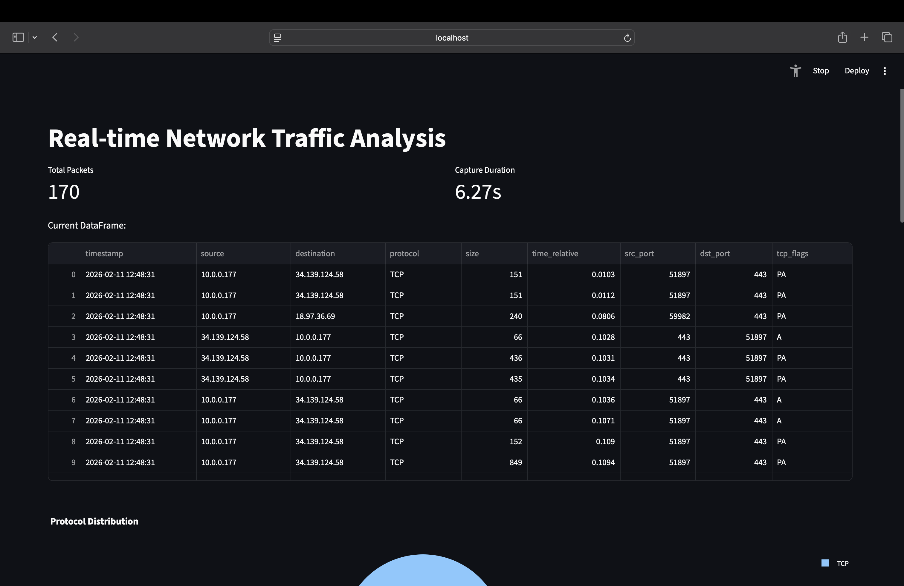
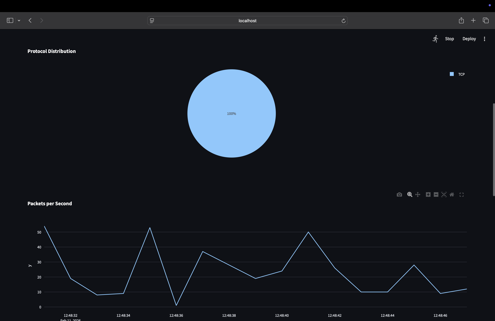
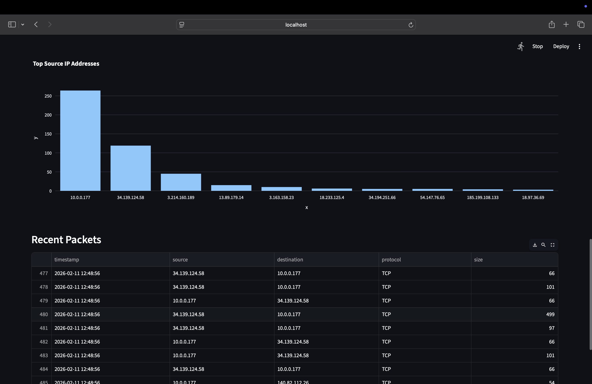

# Real-Time Network Traffic Analysis Tool

A Python-based real-time network traffic analysis tool that captures, processes, and visualizes live network packets using an interactive Streamlit dashboard. This project demonstrates proficiency in network programming, multithreading, software design patterns, and clean coding practices.

---

## Screenshots







---

## Table of Contents

- [Overview](#overview)
- [Features](#features)
- [Project Architecture](#project-architecture)
- [Design Patterns and Coding Standards](#design-patterns-and-coding-standards)
- [Tech Stack](#tech-stack)
- [Prerequisites](#prerequisites)
- [Installation](#installation)
- [Usage](#usage)
- [Docker Deployment](#docker-deployment)
- [Project Structure](#project-structure)
- [Key Technical Highlights](#key-technical-highlights)
- [Future Enhancements](#future-enhancements)
- [License](#license)

---

## Overview

This application captures live network traffic on the host machine, processes each packet to extract protocol-level metadata, and renders the results on a real-time Streamlit dashboard. It supports TCP, UDP, and ICMP protocols and provides interactive visualizations including protocol distribution, packet frequency timelines, and top source IP identification.

---

## Features

- Live packet capture and real-time analysis of network traffic.
- Protocol identification for TCP, UDP, ICMP, and other IP-based protocols.
- Extraction of TCP-specific metadata such as source/destination ports and flags.
- Extraction of UDP-specific metadata including source and destination ports.
- Interactive dashboard with auto-refresh capability.
- Protocol distribution pie chart.
- Packets-per-second timeline chart.
- Top 10 source IP addresses bar chart.
- Recent packet table with key fields.
- Memory-efficient packet storage with a rolling window of 10,000 packets.

---

## Project Architecture

The project follows a modular architecture with clear separation of concerns. Each module is responsible for a single, well-defined aspect of the application:

```
network_dashboard.py    -- Application entry point and Streamlit UI orchestration
packet_processor.py     -- Packet capture processing and data extraction
visualizations.py       -- Visualization strategy classes and chart rendering
logger_config.py        -- Centralized logging configuration
```

This structure ensures that each component can be developed, tested, and maintained independently.

---

## Design Patterns and Coding Standards

### Strategy Pattern (Visualizations)

The visualization module implements the **Strategy design pattern**. Each chart type (pie chart, line chart, bar chart) is encapsulated in its own class that implements a common `VisualizationStrategy` interface. This design provides the following benefits:

- **Open/Closed Principle**: New visualization types can be added by creating a new strategy class without modifying existing code.
- **Single Responsibility Principle**: Each visualization class handles only one type of chart.
- **Scalability**: Adding a new chart requires only a new class and registering it in the strategies list.

### SOLID Principles

- **Single Responsibility**: Each module and class has a clearly defined responsibility. `PacketProcessor` handles packet processing, `VisualizationStrategy` subclasses handle individual chart types, and `logger_config` manages logging.
- **Open/Closed**: The visualization system is open for extension (new chart types) but closed for modification of existing logic.
- **Dependency Inversion**: Modules depend on abstractions (the strategy interface) rather than concrete implementations.

### DRY (Don't Repeat Yourself)

- Logging configuration is defined once in `logger_config.py` and imported wherever needed, avoiding duplicated setup code across modules.
- Common visualization rendering logic is handled through a shared interface, eliminating redundant boilerplate.

### Thread Safety

- The `PacketProcessor` class uses `threading.Lock` to ensure safe concurrent access to shared packet data between the capture thread and the Streamlit UI thread.
- Packet capture runs in a daemon thread, allowing the main application to terminate cleanly.

### Type Annotations

- Functions and methods include Python type hints for parameters and return values, improving code readability and enabling static analysis tools to catch type-related issues early.

---

## Tech Stack

| Component         | Technology      |
|-------------------|-----------------|
| Language          | Python 3.11     |
| Packet Capture    | Scapy           |
| Web Framework     | Streamlit       |
| Data Processing   | Pandas          |
| Visualization     | Plotly Express  |
| Concurrency       | Threading       |
| Logging           | Python logging  |

---

## Prerequisites

- Python 3.11 or higher
- macOS, Linux, or Windows (with appropriate permissions for packet capture)
- Root/Administrator privileges (required for raw packet capture)

---

## Installation

1. Clone the repository:

```bash
git clone https://github.com/shubhamk/Real_Time_Network.git
cd Real_Time_Network
```

2. Create and activate a virtual environment:

```bash
python3 -m venv venv
source venv/bin/activate
```

3. Install dependencies:

```bash
pip install streamlit pandas scapy plotly
```

---

## Usage

Run the application with root privileges (required by Scapy for raw packet capture):

```bash
sudo $(which streamlit) run network_dashboard.py
```

Or, using the virtual environment path directly:

```bash
sudo /path/to/venv/bin/streamlit run network_dashboard.py
```

The dashboard will open in your default browser at `http://localhost:8501`.

---

## Docker Deployment

This application can be containerized using Docker for portable, consistent deployment. Docker is particularly beneficial for this project because Scapy requires root privileges for raw packet capture. Running the app inside a Docker container with `--privileged` provides the necessary access while keeping elevated privileges sandboxed within the container, rather than exposing them across the entire host system.

### Why Docker for This Project

| Approach | Privilege Scope | Risk |
|---|---|---|
| `sudo` on host | Entire host system | High: full system access |
| Docker `--privileged` | Inside container only | Low: isolated from host |

Key benefits:

- **Security Isolation**: Root privileges are confined to the container. If something goes wrong (a crash, exploit, or bug), the damage is limited to the container. The host system and other services remain unaffected.
- **No Host-Level Root Needed**: The user running Docker does not need to grant root access to the Python application on the host.
- **Disposable Environment**: If the container is compromised, destroy it and spin up a new one. The host remains untouched.
- **Consistent Environment**: The app runs identically regardless of the host OS. No dependency conflicts or "works on my machine" issues.
- **Reproducible Builds**: The Dockerfile serves as a versioned, repeatable build script.
- **CI/CD Ready**: Integrates with GitHub Actions, Jenkins, or GitLab CI for automated builds and deployments.

### Build and Run

1. Build the Docker image:

```bash
docker build -t network-dashboard .
```

2. Run the container with privileged access (required for Scapy packet capture):

```bash
docker run --privileged -p 8501:8501 network-dashboard
```

3. Access the dashboard at `http://localhost:8501`.

### Stopping the Container

```bash
docker ps                          # Find the container ID
docker stop <container_id>         # Stop the container
```

---

## Project Structure

```
Real_Time_Network/
|
|-- network_dashboard.py      # Main application entry point and Streamlit UI
|-- packet_processor.py       # PacketProcessor class for capturing and processing packets
|-- visualizations.py         # Strategy pattern-based visualization classes
|-- logger_config.py          # Centralized logging configuration
|-- .gitignore                # Git ignore rules for Python/Streamlit projects
|-- .dockerignore             # Files excluded from Docker build context
|-- Dockerfile                # Docker container configuration
|-- requirements.txt          # Python dependencies
|-- README.md                 # Project documentation
|-- venv/                     # Python virtual environment (not tracked in git)
```

---

## Key Technical Highlights

### Multithreading for Non-Blocking Packet Capture

Network packet capture is a blocking operation. To prevent it from freezing the Streamlit UI, packet sniffing runs in a separate daemon thread. The main thread handles rendering and user interaction, while the background thread continuously captures and processes packets. Thread-safe access to shared data is ensured through the use of `threading.Lock`.

### Memory Management

The application maintains a rolling window of the most recent 10,000 packets. Older packets are discarded to prevent unbounded memory growth during extended capture sessions.

### Extensible Visualization Framework

The Strategy pattern used in the visualization layer allows new chart types to be integrated with minimal effort. To add a new visualization:

1. Create a new class that inherits from `VisualizationStrategy`.
2. Implement the `render(self, df: pd.DataFrame)` method.
3. Add the new class to the strategies list in `create_visualizations()`.

No existing code needs to be modified.

### Centralized Logging

All logging configuration is managed in a single module (`logger_config.py`), providing consistent log formatting and level management across the entire application. This avoids scattered logging setup and makes it straightforward to adjust log levels or output destinations.

### Session State Management

Streamlit's `st.session_state` is used to persist the `PacketProcessor` instance across UI reruns, ensuring that captured packet data is not lost when the dashboard refreshes.

---

## Future Enhancements

- Add packet filtering by protocol, IP address, or port number.
- Implement geographic IP mapping using GeoIP databases.
- Add export functionality for captured packet data (CSV, JSON).
- Integrate alerting for anomalous traffic patterns.
- Add support for additional protocols (DNS, HTTP, ARP).
- Implement a database backend for persistent packet storage.
- Add unit and integration tests for all modules.

---

## License

This project is open source and available under the [MIT License](LICENSE).
